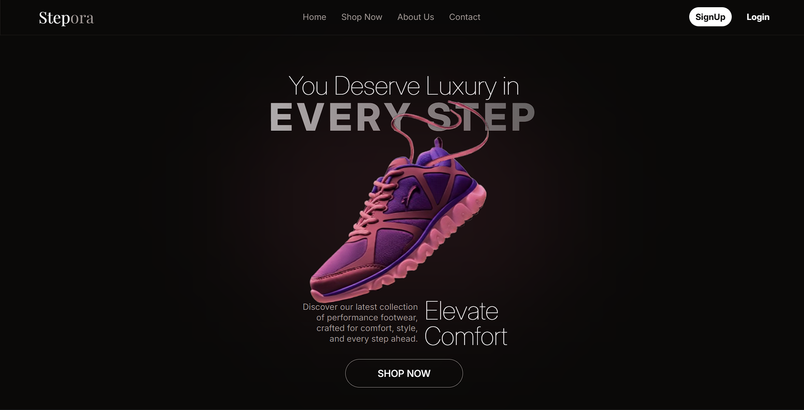

# 👟 Stepora

> **A modern footwear e-commerce platform built with the MERN stack.**

Stepora is a full-stack e-commerce web application focused on providing a modern and seamless online shopping experience for footwear.

The project is currently **under active development**. The goal is to build a complete e-commerce platform with a modern customer-facing storefront, secure backend APIs, product management, shopping cart functionality, authentication, and an administrative dashboard.

---

## 🚧 Project Status

**Status: In Development 🛠️**

Stepora is being developed incrementally, starting with the customer-facing storefront and product system before moving toward authentication, cart, orders, payments, and administration.

Some features listed in the roadmap are **planned and are not implemented yet**.

---

## 🎯 Project Goals

The main purpose of Stepora is to build a realistic full-stack e-commerce application while gaining practical experience with:

* MERN stack development
* REST API architecture
* React component-based development
* State management with Zustand
* MongoDB and Mongoose
* User authentication and authorization
* Product management
* Image upload and cloud storage
* Shopping cart and order management
* Responsive and modern UI design
* Frontend and backend integration
* Scalable project structure

---

# ✨ Current Features

The following features are currently being developed or implemented.

### 🏠 Home Page

The Stepora homepage is designed as a modern footwear storefront and currently includes sections such as:

* Hero section
* Product/category discovery
* Footwear categories
* Craft/brand story section
* Store facilities/benefits section
* Navigation
* Footer

### 🛍️ Product & Shop System

The current storefront includes:

* Product listing
* Product cards
* Product grid
* Product search
* Category filtering
* Product details page
* Dynamic product routes
* Product API integration
* Loading and error handling

Products can be accessed through routes such as:

```text
/products
/products/:id
```

Category and search parameters are also used for product filtering.

### 🔗 Frontend API Integration

The frontend communicates with the backend using **Axios**.

The API layer is separated into service files so that API communication remains independent from UI components.

Example structure:

```text
services/
├── api.js
└── productServices.js
```

### 🗃️ State Management

Stepora uses **Zustand** for frontend state management.

Currently, product fetching is handled through a dedicated product store.

```text
store/
└── productStore.js
```

This structure will allow additional application state such as cart, authentication, and user information to be added later.

---

# 🧰 Technology Stack

## Frontend

* **React 19**
* **React Router**
* **Zustand**
* **Axios**
* **Tailwind CSS**
* **Motion**
* **React Icons**
* **Vite**

## Backend

* **Node.js**
* **Express.js**
* **MongoDB**
* **Mongoose**

## Authentication & Security

Current backend technologies include:

* **JSON Web Token (JWT)**
* **bcryptjs**
* **HTTP cookies**
* **cookie-parser**
* **CORS**

## File & Image Management

* **Multer** — handling uploaded files
* **Cloudinary** — cloud image storage

## Email

* **Nodemailer** — email communication

---

# 📁 Project Structure

Stepora is organized as a full-stack project with separate applications for the customer frontend, administration panel, and backend API.

```text
Ecommerce__MERN/
│
├── client/                 # Customer-facing React application
│   │
│   ├── public/
│   │
│   └── src/
│       ├── components/
│       │   ├── common/
│       │   ├── home/
│       │   ├── layout/
│       │   └── product/
│       │
│       ├── layouts/
│       │
│       ├── pages/
│       │
│       ├── services/
│       │   ├── api.js
│       │   └── productServices.js
│       │
│       ├── store/
│       │   └── productStore.js
│       │
│       ├── App.jsx
│       ├── main.jsx
│       └── index.css
│
├── admin/                  # Admin dashboard application
│   └── src/
│       ├── App.jsx
│       ├── main.jsx
│       └── index.css
│
├── server/                 # Express backend
│   ├── config/
│   ├── controllers/
│   ├── middleware/
│   ├── models/
│   ├── routes/
│   ├── services/
│   ├── utils/
│   └── server.js
│
└── README.md
```

---

# 🏗️ Application Architecture

Stepora follows a client-server architecture.

```text
                 ┌─────────────────────┐
                 │       User          │
                 └──────────┬──────────┘
                            │
                            ▼
                 ┌─────────────────────┐
                 │   React Frontend    │
                 │      /client        │
                 └──────────┬──────────┘
                            │
                         Axios
                            │
                            ▼
                 ┌─────────────────────┐
                 │   Express Server    │ 
                 │      /server        │
                 └──────────┬──────────┘
                            │
                            ▼
                 ┌─────────────────────┐
                 │      MongoDB        │
                 └─────────────────────┘
```

External services will be integrated where required:

```text
React
  │
  ▼
Express API
  │
  ├──── MongoDB
  │
  ├──── Cloudinary
  │
  └──── Nodemailer
```

---

# 🔄 Product Data Flow

The current product flow is structured around **services → store → components**.

```text
Product Page
     │
     ▼
Zustand Store
     │
     ▼
Product Service
     │
     ▼
Axios API
     │
     ▼
Express API
     │
     ▼
MongoDB
```

This separation keeps the application easier to maintain and allows business logic to remain separate from presentation components.

---

# 🛣️ Current Routes

The current customer application contains the following main routes:

| Route           | Purpose                    |
| --------------- | -------------------------- |
| `/`             | Home page                  |
| `/products`     | Shop/product listing       |
| `/products/:id` | Individual product details |

More routes will be added as development continues.

---

# 👟 Product Categories

Stepora is focused specifically on footwear.

Current categories include:

- 🏃 **Running** — Performance-focused footwear designed for runners and everyday road use.
- 🏋️ **Training** — Versatile shoes built for workouts, gym sessions, and functional training.
- 🚶 **Lifestyle** — Comfortable and stylish footwear designed for everyday wear and casual movement.

---

# 🗄️ Database

Stepora uses **MongoDB** as its primary database with **Mongoose** for data modeling and database interaction.

The database will eventually contain collections/models for areas such as:

```text
Users
Products
Carts
Orders
```

Additional models may be introduced as the project grows.

---

# 🔐 Authentication

Authentication is part of the backend architecture and will provide secure user access.

The planned authentication flow is:

```text
Register
   │
   ▼
Validate User
   │
   ▼
Hash Password
   │
   ▼
Save User
   │
   ▼
Login
   │
   ▼
Generate JWT
   │
   ▼
Authentication Cookie
   │
   ▼
Protected Requests
```

Authentication will eventually be used for features such as:

* User accounts
* Cart management
* Orders
* Protected resources
* Admin authorization

---

# ☁️ Cloudinary Integration

Stepora uses **Cloudinary** for product image management.

The planned image flow is:

```text
Admin
  │
  ▼
Upload Product Image
  │
  ▼
Multer
  │
  ▼
Cloudinary
  │
  ▼
Image URL
  │
  ▼
MongoDB Product
```

This keeps image files out of the database while storing their references with product information.

---

# 📧 Email Integration

**Nodemailer** is included in the backend for email functionality.

Email features can later be used for:

* Account verification
* Password reset
* Order confirmation
* Order updates
* Other transactional emails

---

# 🚀 Future Improvements

As development continues, Stepora will be improved with:

* Advanced product filtering
* Sorting
* Pagination
* Wishlist
* Product reviews
* Order management
* Payment integration
* Admin analytics
* Inventory tracking
* Better error handling
* Form validation
* Performance optimization
* SEO improvements
* Production deployment

---

# 💻 Installation

Clone the repository:

```bash
git clone https://github.com/M-Kaif-08/Ecommerce__MERN.git
```

Move into the project:

```bash
cd Ecommerce__MERN
```

---

## Install Client Dependencies

```bash
cd client
npm install
```

Run the client:

```bash
npm run dev
```

---

## Install Server Dependencies

Open another terminal:

```bash
cd server
npm install
```

Run the server:

```bash
npm run dev
```

---

## Install Admin Dependencies

The admin application is maintained separately from the customer application.

```bash
cd admin
npm install
```

Run the admin application:

```bash
npm run dev
```

> The admin dashboard is currently in the initial development stage.

---

# 🔑 Environment Variables

The backend will use environment variables for sensitive configuration.

Example:

```env
PORT=5000

MONGO_URI=your_mongodb_connection_string

JWT_SECRET=your_jwt_secret

CLOUDINARY_CLOUD_NAME=your_cloudinary_cloud_name
CLOUDINARY_API_KEY=your_cloudinary_api_key
CLOUDINARY_API_SECRET=your_cloudinary_api_secret

EMAIL_USER=your_email
EMAIL_PASS=your_email_password
```

For the client, the API URL can be configured through Vite environment variables:

```env
VITE_API_URL=your_backend_api_url
```

**Never commit ****`.env`**** files or secret credentials to GitHub.**

---

# 📸 Screenshots



---

# 📌 Development Roadmap

Stepora development will follow approximately this order:

```text
1. UI / Design
      ↓
2. Product System
      ↓
3. Backend API
      ↓
4. Authentication
      ↓
5. Cart
      ↓
6. Checkout & Orders
      ↓
7. Admin Dashboard
      ↓
8. Payment Integration
      ↓
9. Testing
      ↓
10. Deployment
```

---

# 📚 What This Project Demonstrates

Stepora is intended to demonstrate practical knowledge of:

* React.js
* Modern JavaScript
* REST APIs
* Express.js
* MongoDB
* Mongoose
* Zustand
* Axios
* JWT authentication
* Password hashing
* File uploads
* Cloudinary
* Nodemailer
* Tailwind CSS
* Responsive web design
* Component-based architecture
* Full-stack application development

---

# 🤝 Contributing

Stepora is currently a personal project under active development.

As the project matures, contribution guidelines may be added.

---

# 📄 License

This project is currently developed for **learning, portfolio, and educational purposes**.

---

# 👟 Stepora

**Crafted for Every Step.**

A footwear e-commerce experience built with modern web technologies.
